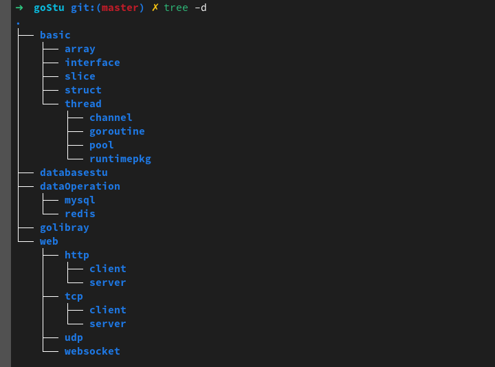
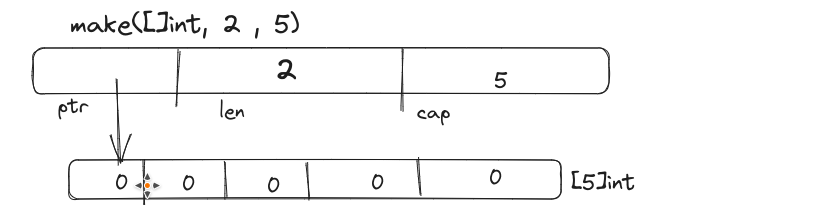
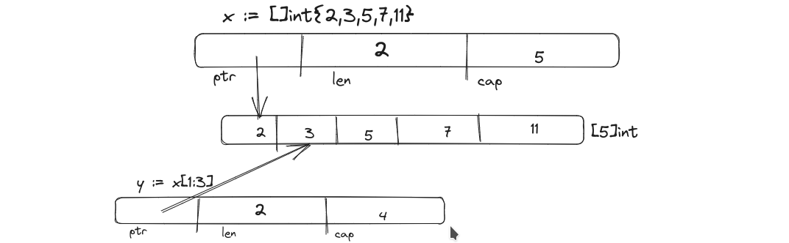

# go基础学习笔记



## 1.	命令

```shell
$ go
Go is a tool for managing Go source code.

Usage:

    go command [arguments]

The commands are:

    build       compile packages and dependencies
    clean       remove object files
    doc         show documentation for package or symbol
    env         print Go environment information
    bug         start a bug report
    fix         run go tool fix on packages
    fmt         run gofmt on package sources
    generate    generate Go files by processing source
    get         download and install packages and dependencies
    install     compile and install packages and dependencies
    list        list packages
    run         compile and run Go program
    test        test packages
    tool        run specified go tool
    version     print Go version
    vet         run go tool vet on packages

Use "go help [command]" for more information about a command.

Additional help topics:

    c           calling between Go and C
    buildmode   description of build modes
    filetype    file types
    gopath      GOPATH environment variable
    environment environment variables
    importpath  import path syntax
    packages    description of package lists
    testflag    description of testing flags
    testfunc    description of testing functions

Use "go help [topic]" for more information about that topic.
```

go env用于打印Go语言的环境信息。

go run命令可以编译并运行命令源码文件。

go get可以根据要求和实际情况从互联网上下载或更新指定的代码包及其依赖包，并对它们进行编译和安装。

go build命令用于编译我们指定的源码文件或代码包以及它们的依赖包。

go install用于编译并安装指定的代码包及它们的依赖包。

go clean命令会删除掉执行其它命令时产生的一些文件和目录。

go doc命令可以打印附于Go语言程序实体上的文档。我们可以通过把程序实体的标识符作为该命令的参数来达到查看其文档的目的。

go test命令用于对Go语言编写的程序进行测试。

go list命令的作用是列出指定的代码包的信息。

go fix会把指定代码包的所有Go语言源码文件中的旧版本代码修正为新版本的代码。

go vet是一个用于检查Go语言源码中静态错误的简单工具。

go tool pprof命令来交互式的访问概要文件的内容。


## 2.	运算符


1.算数运算符

| 运算符 | 作用 |
| ------ | ---- |
| +      | 相加 |
| -      | 减   |
| *      | 乘   |
| /      | 除   |
| %      | 求余 |

2.逻辑运算符

| 运算符 | 描述                                                         |
| ------ | ------------------------------------------------------------ |
| &&     | 逻辑 AND 运算符。 如果两边的操作数都是 True，则为 True，否则为 False。 |
| ll     | 逻辑 OR 运算符。 如果两边的操作数有一个 True，则为 True，否则为 False。 |
| !      | 逻辑 NOT 运算符。 如果条件为 True，则为 False，否则为 True   |

3.位运算符

| 运算符 | 描述                                                         |
| ------ | ------------------------------------------------------------ |
| &      | 参与运算的两数各对应的二进位相与。（两位均为1才为1）         |
| l      | 参与运算的两数各对应的二进位相或。（两位有一个为1就为1）     |
| ^      | 参与运算的两数各对应的二进位相异或，当两对应的二进位相异时，结果为1。（两位不一样则为1） |
| <<     | 左移n位就是乘以2的n次方。“a<<b”是把a的各二进位全部左移b位，高位丢弃，低位补0。 |
| >>     | 右移n位就是除以2的n次方。“a>>b”是把a的各二进位全部右移b位。  |

4.赋值运算符

| 运算符 | 描述                                           |
| ------ | ---------------------------------------------- |
| =      | 简单的赋值运算符，将一个表达式的值赋给一个左值 |
| +=     | 相加后再赋值                                   |
| -=     | 相减后再赋值                                   |
| *=     | 相乘后再赋值                                   |
| /=     | 相除后再赋值                                   |
| %=     | 求余后再赋值                                   |
| <<=    | 左移后赋值                                     |
| >>=    | 右移后赋值                                     |
| &=     | 按位与后赋值                                   |
| l=     | 按位或后赋值                                   |
| ^=     | 按位异或后赋值                                 |


## 3.	init 和 main函数

init函数

go语言中`init`函数用于包`(package)`的初始化，该函数是go语言的一个重要特性。

有下面的特征：

```
    1 init函数是用于程序执行前做包的初始化的函数，比如初始化包里的变量等

    2 每个包可以拥有多个init函数

    3 包的每个源文件也可以拥有多个init函数

    4 同一个包中多个init函数的执行顺序go语言没有明确的定义(说明)

    5 不同包的init函数按照包导入的依赖关系决定该初始化函数的执行顺序

    6 init函数不能被其他函数调用，而是在main函数执行之前，自动被调用
```

1.2. main函数

```
    Go语言程序的默认入口函数(主函数)：func main()
    函数体用｛｝一对括号包裹。

    func main(){
        //函数体
    }
```

1.3. init函数和main函数的异同

```
    相同点：
        两个函数在定义时不能有任何的参数和返回值，且Go程序自动调用。
    不同点：
        init可以应用于任意包中，且可以重复定义多个。
        main函数只能用于main包中，且只能定义一个。
```

两个函数的执行顺序：

对同一个go文件的`init()`调用顺序是从上到下的。

对同一个package中不同文件是按文件名字符串比较“从小到大”顺序调用各文件中的`init()`函数。

对于不同的`package`，如果不相互依赖的话，按照main包中"先`import`的后调用"的顺序调用其包中的`init()`，如果`package`存在依赖，则先调用最早被依赖的`package`中的`init()`，最后调用`main`函数。

如果`init`函数中使用了`println()`或者`print()`你会发现在执行过程中这两个不会按照你想象中的顺序执行。这两个函数官方只推荐在测试环境中使用，对于正式环境不要使用。


## 4.	变量和常量

### 变量

1. ​	标准声明

   ```go
     var 变量名 变量类型
   ```

   ```go
   var name string
   var age int
   var isOk bool
   ```

   

2.  批量声明

   ```go
   var (
       a string
       b int
       c bool
       d float32
   )
   ```

   

3. 变量初始化

   ```go
    var 变量名 类型 = 表达式
   ```

   ```go
       var name string = "pprof.cn"
       var sex int = 1
   ```

   

   3.1	变量推倒声明

   ```go
       var name = "pprof.cn"
       var sex = 1
   ```

   

   3.2 	短变量声明

   ```go
   package main
   
   import (
       "fmt"
   )
   // 全局变量m
   var m = 100
   
   func main() {
       n := 10
       m := 200 // 此处声明局部变量m
       fmt.Println(m, n)
   }
   ```

   3.3	匿名变量

   在使用多重赋值时，如果想要忽略某个值，可以使用`匿名变量（anonymous variable）`。 匿名变量用一个下划线_表示，例如：

   ```go
   func foo() (int, string) {
       return 10, "Q1mi"
   }
   func main() {
       x, _ := foo()
       _, y := foo()
       fmt.Println("x=", x)
       fmt.Println("y=", y)
   }
   ```

   匿名变量不占用命名空间，不会分配内存，所以匿名变量之间不存在重复声明。 (在Lua等编程语言里，匿名变量也被叫做哑元变量。)

   注意事项：

   ```
       函数外的每个语句都必须以关键字开始（var、const、func等）
   
       :=不能使用在函数外。
   
       _多用于占位，表示忽略值。
   ```

### 常量

1. 标准常量声明

   ```go
       const pi = 3.1415
       const e = 2.7182
   ```

   

2. 批量

   ```go
       const (
           pi = 3.1415
           e = 2.7182
       )
   ```

   ```go
       const (
           n1 = 100
           n2
           n3
       )
   ```

   

### iota

`iota`是`go`语言的常量计数器，只能在常量的表达式中使用。 `iota`在`const`关键字出现时将被重置为`0`。`const`中每新增一行常量声明将使`iota`计数一次(`iota`可理解为`const`语句块中的行索引)。 使用`iota`能简化定义，在定义枚举时很有用。

```go
    const (
            n1 = iota //0
            n2        //1
            n3        //2
            n4        //3
        )
```

几个常见的iota示例:

使用_跳过某些值

```go
    const (
            n1 = iota //0
            n2        //1
            _
            n4        //3
        )
```

`iota`声明中间插队

```go
    const (
            n1 = iota //0
            n2 = 100  //100
            n3 = iota //2
            n4        //3
        )
    const n5 = iota //0
```

定义数量级 （这里的`<<`表示左移操作，`1<<10`表示将`1`的二进制表示向左移`10`位，也就是由`1`变成了`10000000000`，也就是十进制的`1024`。同理`2<<2`表示将`2`的二进制表示向左移`2`位，也就是由`10`变成了`1000`，也就是十进制的`8`。）

```go
    const (
            _  = iota
            KB = 1 << (10 * iota)
            MB = 1 << (10 * iota)
            GB = 1 << (10 * iota)
            TB = 1 << (10 * iota)
            PB = 1 << (10 * iota)
        )
```

多个`iota`定义在一行

```go
    const (
            a, b = iota + 1, iota + 2 //1,2
            c, d                      //2,3
            e, f                      //3,4
        )
```


##  5.	基本类型

### 基础类型介绍

| 类型          | 长度(字节) | 默认值 | 说明                                      |
| ------------- | ---------- | ------ | ----------------------------------------- |
| bool          | 1          | false  |                                           |
| byte          | 1          | 0      | uint8                                     |
| rune          | 4          | 0      | Unicode Code Point, int32                 |
| int, uint     | 4或8       | 0      | 32 或 64 位                               |
| int8, uint8   | 1          | 0      | -128 ~ 127, 0 ~ 255，byte是uint8 的别名   |
| int16, uint16 | 2          | 0      | -32768 ~ 32767, 0 ~ 65535                 |
| int32, uint32 | 4          | 0      | -21亿~ 21亿, 0 ~ 42亿，rune是int32 的别名 |
| int64, uint64 | 8          | 0      |                                           |
| float32       | 4          | 0.0    |                                           |
| float64       | 8          | 0.0    |                                           |
| complex64     | 8          |        |                                           |
| complex128    | 16         |        |                                           |
| uintptr       | 4或8       |        | 以存储指针的 uint32 或 uint64 整数        |
| array         |            |        | 值类型                                    |
| struct        |            |        | 值类型                                    |
| string        |            | ""     | UTF-8 字符串                              |
| slice         |            | nil    | 引用类型                                  |
| map           |            | nil    | 引用类型                                  |
| channel       |            | nil    | 引用类型                                  |
| interface     |            | nil    | 接口                                      |
| function      |            | nil    | 函数                                      |

## 6.	数组Array

```
    1. 数组：是同一种数据类型的固定长度的序列。
    2. 数组定义：var a [len]int，比如：var a [5]int，数组长度必须是常量，且是类型的组成部分。一旦定义，长度不能变。
    3. 长度是数组类型的一部分，因此，var a[5] int和var a[10]int是不同的类型。
    4. 数组可以通过下标进行访问，下标是从0开始，最后一个元素下标是：len-1
    for i := 0; i < len(a); i++ {
    }
    for index, v := range a {
    }
    5. 访问越界，如果下标在数组合法范围之外，则触发访问越界，会panic
    6. 数组是值类型，赋值和传参会复制整个数组，而不是指针。因此改变副本的值，不会改变本身的值。
    7.支持 "=="、"!=" 操作符，因为内存总是被初始化过的。
    8.指针数组 [n]*T，数组指针 *[n]T。
```

### 数组初始化

1. 一维数组

   ```go
       全局：
       var arr0 [5]int = [5]int{1, 2, 3}
       var arr1 = [5]int{1, 2, 3, 4, 5}
       var arr2 = [...]int{1, 2, 3, 4, 5, 6}
       var str = [5]string{3: "hello world", 4: "tom"}
       局部：
       a := [3]int{1, 2}           // 未初始化元素值为 0。
       b := [...]int{1, 2, 3, 4}   // 通过初始化值确定数组长度。
       c := [5]int{2: 100, 4: 200} // 使用索引号初始化元素。
       d := [...]struct {
           name string
           age  uint8
       }{
           {"user1", 10}, // 可省略元素类型。
           {"user2", 20}, // 别忘了最后一行的逗号。
       }package main
   
   import (
       "fmt"
   )
   
   var arr0 [5]int = [5]int{1, 2, 3}
   var arr1 = [5]int{1, 2, 3, 4, 5}
   var arr2 = [...]int{1, 2, 3, 4, 5, 6}
   var str = [5]string{3: "hello world", 4: "tom"}
   
   func main() {
       a := [3]int{1, 2}           // 未初始化元素值为 0。
       b := [...]int{1, 2, 3, 4}   // 通过初始化值确定数组长度。
       c := [5]int{2: 100, 4: 200} // 使用引号初始化元素。
       d := [...]struct {
           name string
           age  uint8
       }{
           {"user1", 10}, // 可省略元素类型。
           {"user2", 20}, // 别忘了最后一行的逗号。
       }
       fmt.Println(arr0, arr1, arr2, str)
       fmt.Println(a, b, c, d)
   }
   ```

   代码：

   ```go
   package main
   
   import (
       "fmt"
   )
   
   var arr0 [5]int = [5]int{1, 2, 3}
   var arr1 = [5]int{1, 2, 3, 4, 5}
   var arr2 = [...]int{1, 2, 3, 4, 5, 6}
   var str = [5]string{3: "hello world", 4: "tom"}
   
   func main() {
       a := [3]int{1, 2}           // 未初始化元素值为 0。
       b := [...]int{1, 2, 3, 4}   // 通过初始化值确定数组长度。
       c := [5]int{2: 100, 4: 200} // 使用引号初始化元素。
       d := [...]struct {
           name string
           age  uint8
       }{
           {"user1", 10}, // 可省略元素类型。
           {"user2", 20}, // 别忘了最后一行的逗号。
       }
       fmt.Println(arr0, arr1, arr2, str)
       fmt.Println(a, b, c, d)
   }
   ```

   结果：

   ```
   
   [1 2 3 0 0] [1 2 3 4 5] [1 2 3 4 5 6] [   hello world tom]
   [1 2 0] [1 2 3 4] [0 0 100 0 200] [{user1 10} {user2 20}]
   ```

   

2. 多维数组

   ```go
   package main
   
   import (
       "fmt"
   )
   
   var arr0 [5][3]int
   var arr1 [2][3]int = [...][3]int{{1, 2, 3}, {7, 8, 9}}
   
   func main() {
       a := [2][3]int{{1, 2, 3}, {4, 5, 6}}
       b := [...][2]int{{1, 1}, {2, 2}, {3, 3}} // 第 2 纬度不能用 "..."。
       fmt.Println(arr0, arr1)
       fmt.Println(a, b)
   }
   ```

   结果

   ```
       [[0 0 0] [0 0 0] [0 0 0] [0 0 0] [0 0 0]] [[1 2 3] [7 8 9]]
       [[1 2 3] [4 5 6]] [[1 1] [2 2] [3 3]]
   ```

   内置函数 len 和 cap 都返回数组长度 (元素数量)。

   ```go
   package main
   
   func main() {
       a := [2]int{}
       println(len(a), cap(a)) 
   }
   ```

   输出结果：

   ```
   2 2
   ```

   值拷贝行为会造成性能问题，通常会建议使用 slice，或数组指针。

   ```go
   package main
   
   import (
       "fmt"
   )
   
   func test(x [2]int) {
       fmt.Printf("x: %p\n", &x)
       x[1] = 1000
   }
   
   func main() {
       a := [2]int{}
       fmt.Printf("a: %p\n", &a)
   
       test(a)
       fmt.Println(a)
   }
   ```

   输出结果:

   ```
       a: 0xc42007c010
       x: 0xc42007c030
       [0 0]
   ```

   ####  多维数组遍历：

   ```go
   package main
   
   import (
       "fmt"
   )
   
   func main() {
   
       var f [2][3]int = [...][3]int{{1, 2, 3}, {7, 8, 9}}
   
       for k1, v1 := range f {
           for k2, v2 := range v1 {
               fmt.Printf("(%d,%d)=%d ", k1, k2, v2)
           }
           fmt.Println()
       }
   }
   ```

   ```
       (0,0)=1 (0,1)=2 (0,2)=3 
       (1,0)=7 (1,1)=8 (1,2)=9
   ```

   

3. 数组拷贝和传参

   ```go
   package main
   
   import "fmt"
   
   func printArr(arr *[5]int) {
       arr[0] = 10
       for i, v := range arr {
           fmt.Println(i, v)
       }
   }
   
   func main() {
       var arr1 [5]int
       printArr(&arr1)
       fmt.Println(arr1)
       arr2 := [...]int{2, 4, 6, 8, 10}
       printArr(&arr2)
       fmt.Println(arr2)
   }
   ```

   


## 7.切片Slice

介绍：

​		slice 并不是数组或者指针。它是通过内部指针和相关属性引用数组片段，以实现变长方案

#### 7.1 创建切片的各种方式

//	声明切片

```go
var s1 []int
```

//	:=

```go
s2 := []int{}
```

// 	make

```go
    var slice []type = make([]type, len)
    slice  := make([]type, len)
    slice  := make([]type, len, cap)
```



//	初始化赋值

```go
s := []int{1,2,3}
```



#### 7.2切片初始化

```go
//全局
var arr = [...]int{0, 1, 2, 3, 4, 5, 6, 7, 8, 9}
var slice0 []int = arr[start:end] 
var slice1 []int = arr[:end]        
var slice2 []int = arr[start:]        
var slice3 []int = arr[:] 
var slice4 = arr[:len(arr)-1]      //去掉切片的最后一个元素

//局部
arr2 := [...]int{9, 8, 7, 6, 5, 4, 3, 2, 1, 0}
slice5 := arr[start:end]
slice6 := arr[:end]        
slice7 := arr[start:]     
slice8 := arr[:]  
slice9 := arr[:len(arr)-1] //去掉切片的最后一个元素
```

| 操作        | 含义                     |
| :---------- | ------------------------ |
| s[n]        | 切片s中索引位置为n的项目 |
| s[:]        | 0到len(s)-1              |
| s[low:]     | low 到len(s)-1           |
| s[:high]    | 0 到hight,len=high       |
| s[low:high] | len = hight-low          |
| len(s)      | 切片长度 ，总是<=cap(s)  |
| cap(s)      | 切片容量，总是>=len(s)   |


#### 7.3 切片基础操作

append

```go
var a = []int{1, 2, 3}
var b = []int{4, 5, 6}
c := append(a, b...)
fmt.Printf("slice c : %v\n", c)
```

```go
 slice c : [1 2 3 4 5 6]
```


超出原 slice.cap 限制，就会重新分配底层数组，即便原数组并未填满

```

data := [...]int{0, 1, 2, 3, 4, 10: 0}
s := data[:2:3]

s = append(s, 100, 200) // 一次 append 两个值，超出 s.cap 限制。

fmt.Println(s, data)         // 重新分配底层数组，与原数组无关。
fmt.Println(&s[0], &data[0]) // 比对底层数组起始指针。

```

```
    [0 1 100 200] [0 1 2 3 4 0 0 0 0 0 0]
    0xc4200160f0 0xc420070060
```


切片拷贝

```go
  s1 := []int{1, 2, 3, 4, 5}
    fmt.Printf("slice s1 : %v\n", s1)

    s2 := make([]int, 10)
    fmt.Printf("slice s2 : %v\n", s2)

    copy(s2, s1)
    fmt.Printf("copied slice s1 : %v\n", s1)
    fmt.Printf("copied slice s2 : %v\n", s2)

    s3 := []int{1, 2, 3}
    fmt.Printf("slice s3 : %v\n", s3)
    s3 = append(s3, s2...)
    fmt.Printf("appended slice s3 : %v\n", s3)
    s3 = append(s3, 4, 5, 6)
    fmt.Printf("last slice s3 : %v\n", s3)

```

```
    slice s1 : [1 2 3 4 5]
    slice s2 : [0 0 0 0 0 0 0 0 0 0]
    copied slice s1 : [1 2 3 4 5]
    copied slice s2 : [1 2 3 4 5 0 0 0 0 0]
    slice s3 : [1 2 3]
    appended slice s3 : [1 2 3 1 2 3 4 5 0 0 0 0 0]
    last slice s3 : [1 2 3 1 2 3 4 5 0 0 0 0 0 4 5 6]
```


copy ：函数 copy 在两个 slice 间复制数据，复制长度以 len 小的为准。两个 slice 可指向同一底层数组，允许元素区间重叠。

```go
    data := [...]int{0, 1, 2, 3, 4, 5, 6, 7, 8, 9}
    fmt.Println("array data : ", data)
    s1 := data[8:]
    s2 := data[:5]
    fmt.Printf("slice s1 : %v\n", s1)
    fmt.Printf("slice s2 : %v\n", s2)
    copy(s2, s1)
    fmt.Printf("copied slice s1 : %v\n", s1)
    fmt.Printf("copied slice s2 : %v\n", s2)
    fmt.Println("last array data : ", data)
```

```
    array data :  [0 1 2 3 4 5 6 7 8 9]
    slice s1 : [8 9]
    slice s2 : [0 1 2 3 4]
    copied slice s1 : [8 9]
    copied slice s2 : [8 9 2 3 4]
    last array data :  [8 9 2 3 4 5 6 7 8 9]
```


slice遍历

```go
    data := [...]int{0, 1, 2, 3, 4, 5, 6, 7, 8, 9}
    slice := data[:]
    for index, value := range slice {
        fmt.Printf("inde : %v , value : %v\n", index, value)
        }
```


切片调整大小

```go
    fmt.Printf("slice a : %v , len(a) : %v\n", a, len(a))
    b := a[1:2]
    fmt.Printf("slice b : %v , len(b) : %v\n", b, len(b))
    c := b[0:3]
    fmt.Printf("slice c : %v , len(c) : %v\n", c, len(c))
```

```
    slice a : [1 3 4 5] , len(a) : 4
    slice b : [3] , len(b) : 1
    slice c : [3 4 5] , len(c) : 3
```


字符串和切片

string底层就是一个byte的数组，因此，也可以进行切片操作。

```go
    str := "hello world"
    s1 := str[0:5]
    fmt.Println(s1)

    s2 := str[6:]
    fmt.Println(s2)
```

```
    hello
    world
```


## 8. map

语法

```
    map[KeyType]ValueType
    
    scoreMap := make(map[string]int, 8)
```


判断key是否存在

```
 value, ok := map[key]
```


map的遍历 

```
    for k, v := range scoreMap {
        fmt.Println(k, v)
    }
```


删除键值对

```
    delete(map, key)
```


元素为map类型的切片

```go
    var mapSlice = make([]map[string]string, 3)
    for index, value := range mapSlice {
        fmt.Printf("index:%d value:%v\n", index, value)
    }
    fmt.Println("after init")
    // 对切片中的map元素进行初始化
    mapSlice[0] = make(map[string]string, 10)
    mapSlice[0]["name"] = "王五"
    mapSlice[0]["password"] = "123456"
    mapSlice[0]["address"] = "红旗大街"
    for index, value := range mapSlice {
        fmt.Printf("index:%d value:%v\n", index, value)
    }
```


值为切片类型的map

```go
    var sliceMap = make(map[string][]string, 3)
    fmt.Println(sliceMap)
    fmt.Println("after init")
    key := "中国"
    value, ok := sliceMap[key]
    if !ok {
        value = make([]string, 0, 2)
    }
    value = append(value, "北京", "上海")
    sliceMap[key] = value
    fmt.Println(sliceMap)
```


## 9.流程控制

### if

```
if 布尔表达式 {
   /* 在布尔表达式为 true 时执行 */
} else {
  /* 在布尔表达式为 false 时执行 */
}
```


### switch

```
switch var1 {
    case val1:
        ...
    case val2:
        ...
    default:
        ...
}
```

​	type switch

```
switch x.(type){
    case type:
       statement(s)      
    case type:
       statement(s)
    /* 你可以定义任意个数的case */
    default: /* 可选 */
       statement(s)
}
```


### select

select 语句类似于 switch 语句，但是select会随机执行一个可运行的case。如果没有case可运行，它将阻塞，直到有case可运行。

```
select {
    case communication clause  :
       statement(s);      
    case communication clause  :
       statement(s);
    /* 你可以定义任意数量的 case */
    default : /* 可选 */
       statement(s);
}
```

​	tips:

​    每个case都必须是一个通信
​    所有channel表达式都会被求值
​    所有被发送的表达式都会被求值
​    如果任意某个通信可以进行，它就执行；其他被忽略。
​    如果有多个case都可以运行，Select会随机公平地选出一个执行。其他不会执行。
​    否则：
​    如果有default子句，则执行该语句。
​    如果没有default字句，select将阻塞，直到某个通信可以运行；Go不会重新对channel或值进行求值。

```
   var c1, c2, c3 chan int
   var i1, i2 int
   select {
      case i1 = <-c1:
         fmt.Printf("received ", i1, " from c1\n")
      case c2 <- i2:
         fmt.Printf("sent ", i2, " to c2\n")
      case i3, ok := (<-c3):  // same as: i3, ok := <-c3
         if ok {
            fmt.Printf("received ", i3, " from c3\n")
         } else {
            fmt.Printf("c3 is closed\n")
         }
      default:
         fmt.Printf("no communication\n")
```

基本使用

select是Go中的一个控制结构，类似于switch语句，用于处理异步IO操作。select会监听case语句中channel的读写操作，当case中channel读写操作为非阻塞状态（即能读写）时，将会触发相应的动作。 select中的case语句必须是一个channel操作

select中的default子句总是可运行的。

1,	如果有多个case都可以运行，select会随机公平地选出一个执行，其他不会执行。

2,	如果没有可运行的case语句，且有default语句，那么就会执行default的动作。

3, 	如果没有可运行的case语句，且没有default语句，select将阻塞，直到某个case通信可以运行


#### 典型用法

1.超时判断

```go
//比如在下面的场景中，使用全局resChan来接受response，如果时间超过3S,resChan中还没有数据返回，则第二条case将执行
var resChan = make(chan int)
// do request
func test() {
    select {
    case data := <-resChan:
        doData(data)
    case <-time.After(time.Second * 3):
        fmt.Println("request time out")
    }
}

func doData(data int) {
    //...
}
```

2.退出

```go
//主线程（协程）中如下：
var shouldQuit=make(chan struct{})
fun main(){
    {
        //loop
    }
    //...out of the loop
    select {
        case <-c.shouldQuit:
            cleanUp()
            return
        default:
        }
    //...
}

//再另外一个协程中，如果运行遇到非法操作或不可处理的错误，就向shouldQuit发送数据通知程序停止运行
close(shouldQuit)
```

3.判断是否堵塞

```go
//在某些情况下是存在不希望channel缓存满了的需求的，可以用如下方法判断
ch := make (chan int, 5)
//...
data：=0
select {
case ch <- data:
default:
    //做相应操作，比如丢弃data。视需求而定
}
```


### for

```
1,    for init; condition; post { }
2,    for condition { }
3,    for { }
```


### range

```
for key, value := range oldMap {
    newMap[key] = value
}
```


### goto,break,continue
